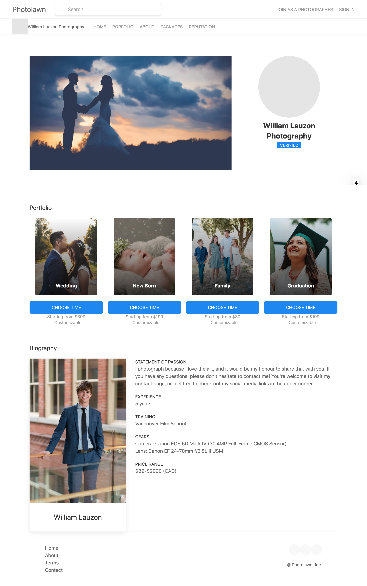
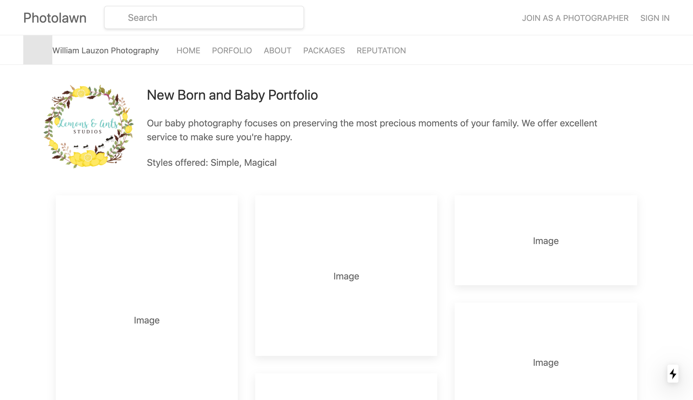

# Photolawn Frontend

## Screenshots

Photographer profile page:


Photographer portfolio page:


## Installation

```bash
git clone https://github.com/photolawn/PhotolawnFrontend.git && cd PhotolawnFrontend
```

```bash
npm install
```

## Running the Code

```bash
npm run dev
```
